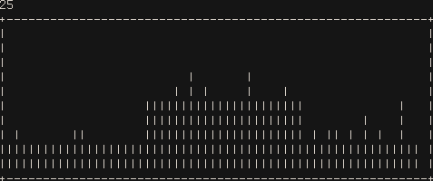

# rtop

A system monitor written in Rust.

To build and run:

    make
    make run

It doesn't do much now. Displays some system stats, which it reads out of procfs, and dies when it gets a character press.

I'll update this readme when there is more going on.
