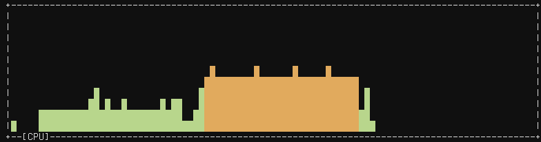

# rtop 

A system monitor written in Rust.

You can build it by just running

    cargo build

## Features working

- Color graphs of one CPU

## Planned features

- Multiple CPUs
- RAM graphs
- Process usage
